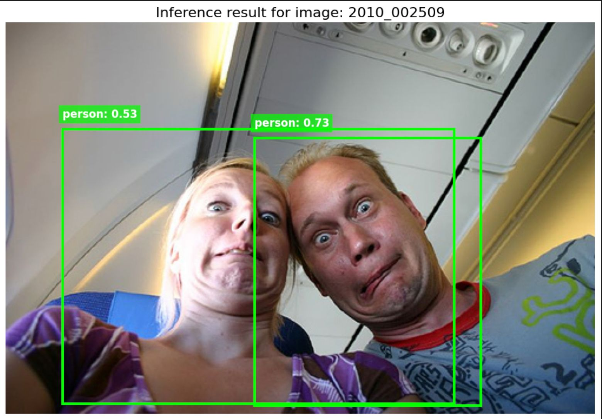
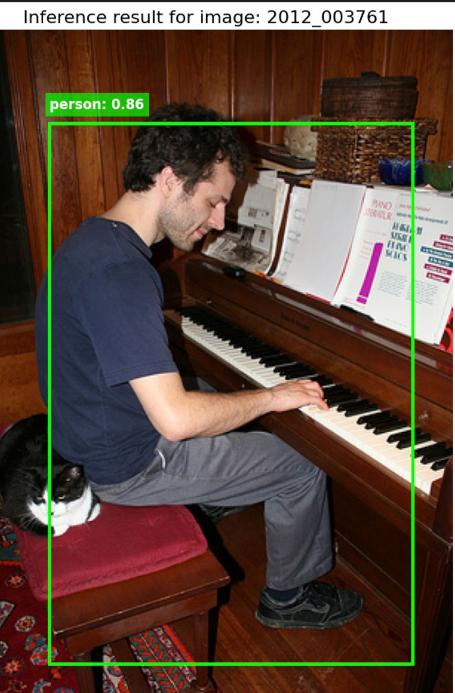
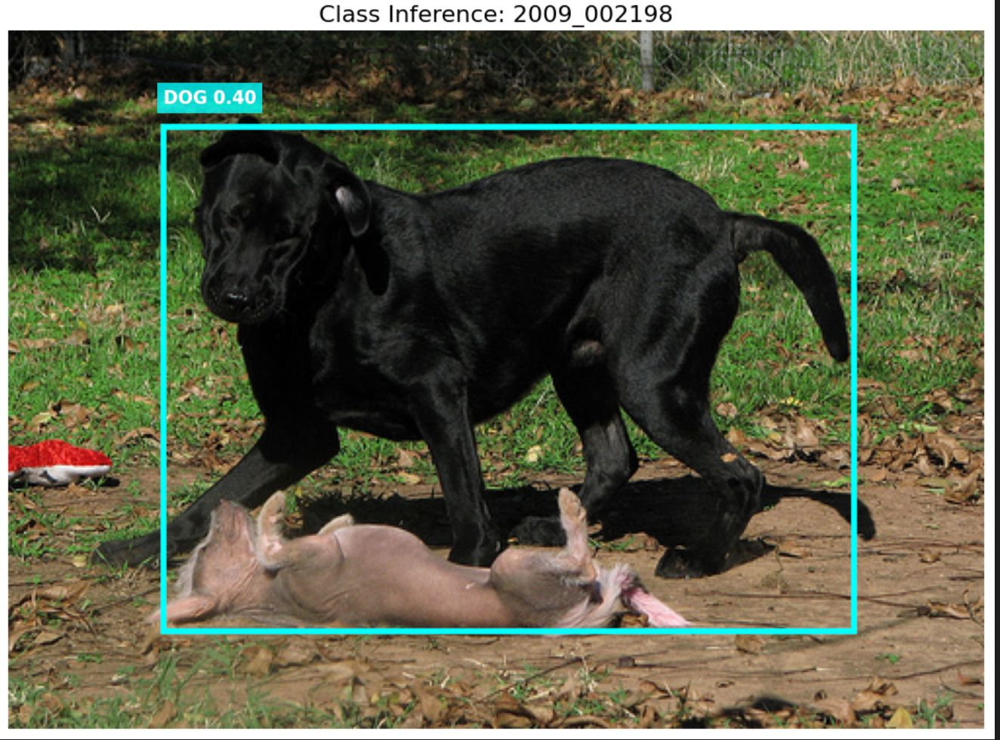

# Training Object Detectors from Scratch: A Comparative Study

A comparative analysis of object detection models trained without pre-trained weights, exploring four different architectural approaches.

**Full Documentation**: [View detailed technical report](https://docs.google.com/document/d/1LKqe3u48F4woSIESQeLVH836Uof1N9cAhCtpytUW__M/edit?usp=sharing)

## Overview

This project compares object detection architectures trained from scratch (no ImageNet pre-training): Custom CNN, Faster R-CNN, Hybrid Transformer, and YOLOv8 Nano.

## Approaches Tested

### 1. Custom Baseline CNN

Single-stage detector with 6-layer architecture.

**Results**: mAP@50: 45.0%, Speed: >120 FPS

**Key Issues**: Grid-based detection struggles with overlapping objects, no feature pyramid for small objects.


### 2. Faster R-CNN with MobileNetV3

Two-stage detector with Region Proposal Network.

**Results**: mAP@50: 21.0%, Speed: ~25 FPS

**Key Issues**: Slow convergence from random initialization, RPN bootstrapping difficulties.



### 3. Hybrid Transformer Architecture

Convolutional stem with Transformer blocks.

**Results**: mAP@50: 1.8%, Speed: ~15 FPS

**Key Issues**: Requires 300+ epochs, did not converge within time constraints.

### 4. YOLOv8 Nano (Best Performer)

Modern single-stage detector with C2f modules and anchor-free head.

**Results**: mAP@50: 61.5%, Speed: ~100 FPS

**Why it works**: Better gradient flow, anchor-free design, decoupled detection head.

## Results Summary

| Model | mAP@50 | FPS | Convergence |
|-------|--------|-----|-------------|
| YOLOv8 Nano | **61.5%** | ~100 | Fast |
| Custom CNN | 45.0% | >120 | Moderate |
| Faster R-CNN | 21.0% | ~25 | Very Slow |
| Transformer | 1.8% | ~15 | Failed |

## Inference Results






## Project Structure

```
.
├── approach1/
│   ├── 1.jpeg - 10.jpeg          # Baseline CNN results
│   └── task1-baseline-cnn.ipynb  # Implementation notebook
├── approach2/
│   ├── 1.jpeg - 10.jpeg          # Faster R-CNN results
│   └── faster-rcnn-task1.ipynb   # Implementation notebook
├── approach3/                    # YOLOv8
│   └── yolo.ipynb
└── approach4/                    # CCTT Transformer
│   └── task1-paper-implementation.ipynb
└── README.md

```

## Key Takeaways

- YOLOv8 Nano achieved best results (61.5% mAP) due to efficient gradient flow architecture
- Two-stage detectors face bootstrapping challenges when trained from scratch
- Transformers require significantly longer training (300+ epochs)
- Mosaic augmentation was critical for avoiding overfitting

For detailed technical analysis, training strategies, and architecture comparisons, see the [full documentation](https://docs.google.com/document/d/1LKqe3u48F4woSIESQeLVH836Uof1N9cAhCtpytUW__M/edit?usp=sharing).
